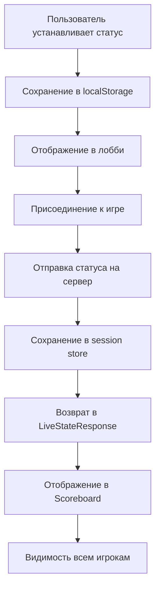

# План улучшений для проекта Color Match

## Контекст
Проект Color Match - это веб-приложение для игры в тест Струпа с многопользовательским режимом. Приложение полностью функционирует, но требует некоторых доработок.

## Задачи

### 1. Статус пользователя
**Текущее состояние**: Статус пользователя (например, "мяу") отображается только в лобби под аватаром.

**Цель**: Сделать статус видимым:
- В режиме выбора игры (select-course)
- Во время игры (в scoreboard)
- Видимым как самому пользователю, так и другим игрокам

**План реализации**:

#### 1.1. Обновление типов данных
- Добавить поле `status?: string` в интерфейс `LivePlayer` (`src/types/live-game.ts`)
- Добавить поле `status?: string` в объект игрока в `LiveStateResponse`
- Обновить интерфейс `ScoreboardPlayer` в `Scoreboard.tsx`

#### 1.2. Обновление API
- Модифицировать схему валидации в `src/app/api/live/sessions/[sessionId]/join/route.ts` для приема `playerStatus`
- Обновить функцию `joinSession` в `src/server/live-session-store.ts` для приема и хранения статуса
- Обновить функцию `createSession` для передачи статуса создателя

#### 1.3. Обновление клиентского API
- Модифицировать `liveApi.joinSession` в `src/lib/live-api.ts` для отправки статуса
- Обновить вызовы `joinSession` в `Lobby.tsx` и `select-course/page.tsx`

#### 1.4. Обновление UI
- **Select-course page**: Добавить отображение статуса рядом с именем пользователя (строка 64)
- **Scoreboard component**: Добавить отображение статуса в карточке игрока
- **Game page**: Рассмотреть отображение статуса в основном интерфейсе игры

#### 1.5. Обновление серверной логики
- Модифицировать `joinSession` в `live-session-store.ts` для сохранения статуса в объекте игрока
- Обновить функцию `calculatePlayerStats` для включения статуса в ответы API

### 2. Темная тема
**Цель**: Создать темную тему в пикми-розовом/фиолетовом цвете как опцию, которую можно включать/выключать.

**План реализации**:

#### 2.1. Создание CSS переменных для темной темы
- Добавить новые CSS переменные в `:root` с префиксом `--dark-` в `src/app/globals.css`
- Определить цвета: темно-розовый (#8a2b5a), фиолетовый (#6a1b9a), темный фон (#1a0b1a)

#### 2.2. Создание класса темы
- Добавить класс `.theme-dark` в `globals.css` с переопределением переменных
- Реализовать плавные переходы между темами

#### 2.3. Система хранения предпочтений
- Создать утилиту для управления темой в `src/lib/theme.ts`
- Использовать `localStorage` для сохранения выбора темы
- Реализовать обнаружение системных предпочтений (prefers-color-scheme)

#### 2.4. Компонент переключателя темы
- Создать компонент `ThemeToggle` в `src/components/theme/ThemeToggle.tsx`
- Добавить переключатель в:
  - Лобби (рядом с кнопками "Моя статистика" и "Рейтинг")
  - Навбар (если будет добавлен в будущем)

#### 2.5. Интеграция с существующей системой тем
- Убедиться, что темная тема работает вместе с существующими `theme-easy`, `theme-medium`, `theme-hard`
- Реализовать приоритет: если включена темная тема, применять ее поверх темы сложности

### 3. Удаление кнопки "запуск от создателя"
**Цель**: Удалить неработающую кнопку "запуск от создателя" из модального окна правил.

**План реализации**:
- Найти модальное окно правил в `src/app/game/[sessionId]/page.tsx` (строки 398-443)
- Удалить блок кода с кнопкой (строки 425-433)
- Убедиться, что логика `isOwner` по-прежнему работает для основной кнопки запуска в лобби

## Приоритеты реализации
1. Удаление кнопки "запуск от создателя" (самая простая задача)
2. Реализация статуса пользователя (наиболее важная функциональность)
3. Темная тема (визуальное улучшение)

## Оценка сложности
- **Статус пользователя**: Средняя сложность (требует изменений на всех уровнях)
- **Темная тема**: Средняя сложность (требует тщательной работы с CSS)
- **Удаление кнопки**: Низкая сложность (простое удаление кода)

## Тестирование
Для каждой задачи необходимо:
1. Проверить, что существующая функциональность не сломана
2. Протестировать в разных браузерах
3. Убедиться в корректной работе в multiplayer-режиме
4. Проверить адаптивность на мобильных устройствах

## Диаграмма потока данных для статуса пользователя

## Следующие шаги
После утверждения плана будет выполнена реализация в режиме Code.